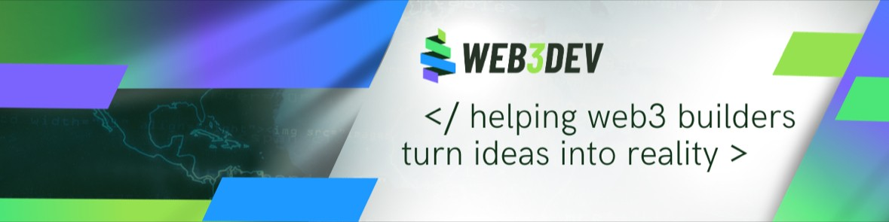

# Welcome to WEB3DEV

<figure><figcaption></figcaption></figure>

<table data-view="cards"><thead><tr><th></th><th data-hidden data-card-cover data-type="files"></th><th data-hidden data-card-target data-type="content-ref"></th></tr></thead><tbody><tr><td><a href="for-developers/"><strong>Accelerate learning and job opportunities</strong></a></td><td><a href=".gitbook/assets/for devs (1).png">for devs (1).png</a></td><td><a href="for-developers/">for-developers</a></td></tr><tr><td><a href="for-businesses-and-partners.md"><strong>Form specialized teams and create web3 technologies</strong></a></td><td><a href=".gitbook/assets/business partners.png">business partners.png</a></td><td><a href="for-businesses-and-partners.md">for-businesses-and-partners.md</a></td></tr><tr><td><a href="https://pt.slideshare.net/secret/GCMLUKPWoQkwhe"><strong>With a vision of growth in the Blockchain market</strong></a></td><td><a href=".gitbook/assets/for investors.png">for investors.png</a></td><td><a href="https://pt.slideshare.net/secret/NLvX62ShZlWGZP">https://pt.slideshare.net/secret/NLvX62ShZlWGZP</a></td></tr></tbody></table>

